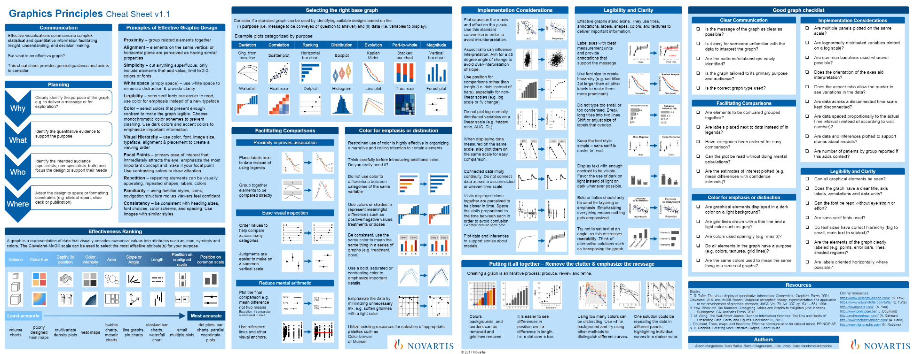

```{r setup, include=FALSE}
knitr::opts_chunk$set(echo = FALSE)
```

```{r, fig.cap="https://github.com/GraphicsPrinciples/CheatSheet/blob/master/NVSCheatSheet.pdf", out.extra="class=internal"}

```

The [cheatsheet](https://github.com/GraphicsPrinciples/CheatSheet/blob/master/NVSCheatSheet.pdf) is available on GitHub along with [R code](https://github.com/GraphicsPrinciples/CheatSheet) for many of the examples.

## Corrections or questions {.appendix}

If you see mistakes, want to suggest changes or ask us a question, please [create an issue](https://github.com/GraphicsPrinciples/GraphicsPrinciples.github.io/issues) on the source repository or [email directly](mailto:bailliem@gmail.com)
