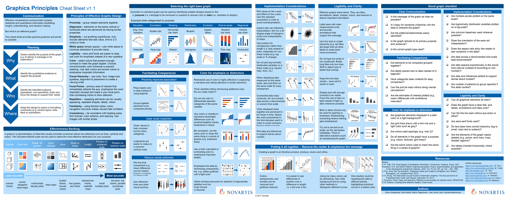

```{r setup, include=FALSE}
knitr::opts_chunk$set(echo = FALSE)
```

```{r, fig.cap="https://github.com/GraphicsPrinciples/CheatSheet/blob/master/NVSCheatSheet.pdf", out.extra="class=internal"}

```

The [cheatsheet](https://github.com/GraphicsPrinciples/CheatSheet/blob/master/NVSCheatSheet.pdf) is available on GitHub along with [R code]((https://github.com/GraphicsPrinciples/CheatSheet)) for many of the examples.