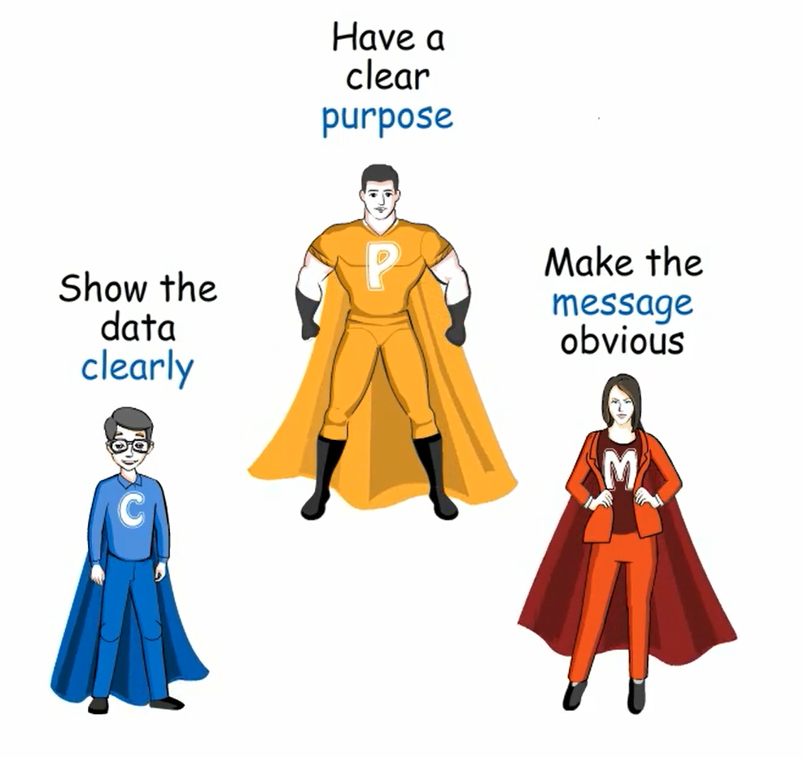

```{r setup, include=FALSE}
knitr::opts_chunk$set(echo = FALSE)
```

```{r, fig.align = 'center'}

```

Effective visual communication is a core skill for all quantitative scientists including statisticians, epidemiologists, machine learning experts, bioinformaticians, etc. By using the right graphical principles, we can better understand data, highlight core insights and influence decisions toward appropriate actions. Without it, we can fool ourselves and others and pave the way to wrong conclusions and actions. 

The goal of these pages is to help quantitative scientists to get this right.
More specifically, you will find:

*	The [three laws](threelaws.html) of effective visual communication
*	A graphics principles [cheat sheet](cheatsheet.html)
*	A [tutorial](tutorial.html) covering both of the above more comprehensively
*	Example [case studies](https://graphicsprinciples.github.io/tutorial-case-studies) from this tutorial with programming code for download
*	The concept of Question-Based Visualizations
*	A [blog](https://graphicsprinciples.github.io/gallery/) with various related articles
*	Some further background of this [initiative](initiative.html), including a related [overview paper](https://onlinelibrary.wiley.com/doi/full/10.1002/pst.1912), that aimed to increase the expertise and productivity of quantitative scientists at [Novartis](https://www.novartis.com/our-science).
*	Links to further [resources & references](resources.html)

We hope that this page proves beneficial for your work. It will evolve further over time.

## Corrections or questions {.appendix}

If you see mistakes, want to suggest changes or even ask us a question, please [create an issue](https://github.com/GraphicsPrinciples/GraphicsPrinciples.github.io/issues) on the source repository or [email directly](mailto:bailliem@gmail.com)

