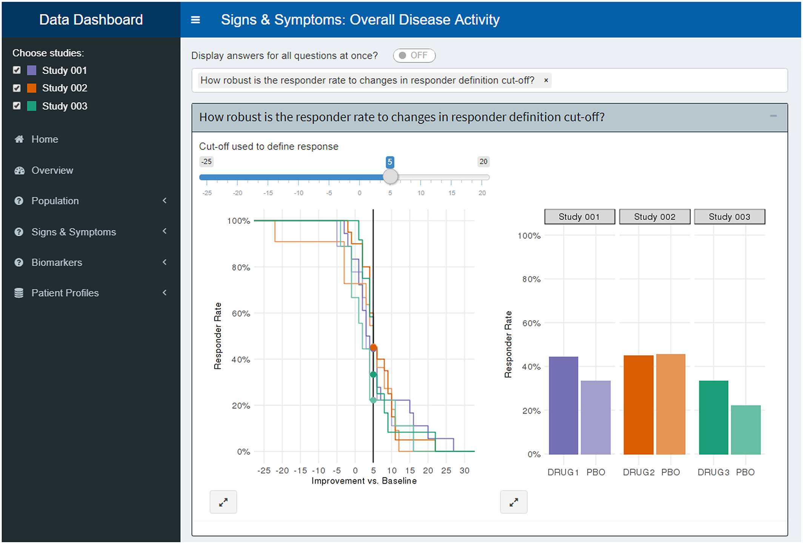

```{r setup, include=FALSE}
knitr::opts_chunk$set(echo = FALSE)
```

Graphics are at the core of exploring and understanding data, communicating results and conclusions, and supporting decision‐making. Increasing our graphical expertise can significantly strengthen our impact as professional statisticians and quantitative scientists.

```{r, fig.cap="Screenshot from the question‐based visualization pilot (data anonymized)"}

```

The [Graphics Principles cheatsheet](https://github.com/GraphicsPrinciples/CheatSheet/blob/master/NVSCheatSheet.pdf) is one deliverable of a [graphics initiative](https://onlinelibrary.wiley.com/doi/full/10.1002/pst.1912) to increase the graphical expertise and productivity of quantitative scientists at [Novartis](https://www.novartis.com/our-science). 

The initative work packages include:

- **The Graph Gallery** - a company-wide resource for graphics and corresponding code, displayed in a web browser

- **The Graphics Principles Cheat Sheet** - a reference sheet summarizing essential graphical display principles on a single page

- **The Graphics Newsletter** - an email communication covering anything and everything relevant to graphics, distributed every two months to approximately 1100 recipients within Novartis, including statisticians, pharmacometricians, medical writers, and various other functions.

- **Analysis Results Datasets (ARD)** - a data standard designed as an extension to the CDISC Analysis Data Model (ADaM) to store results from related inferential analyses and aggregated statistics for easy production of outputs

- **Standardization of common graphs** - a handful of carefully curated graphs selected to represent preapproved standard graphs for inclusion in regulated documents, and included in the Output Governance system (a repository of preapproved standard tables and listings which previously had not included figures)

- **Question-based visualizations** - a work package to encourage a more "top down" approach to creating graphs which starts with the question of interest, followed by the selection of data and graph to best answer the question (instead of the other way around)

For more information on the initiative please check out our publication: [https://onlinelibrary.wiley.com/doi/full/10.1002/pst.1912](https://onlinelibrary.wiley.com/doi/full/10.1002/pst.1912) 

In this article, we present a concerted effort to improve the way we create graphics at Novartis. We provide our vision and guiding principles, before describing seven work packages in more detail. The actions, principles, and experiences laid out in this paper are applicable generally, also beyond drug development, which is our field of work. 


In addition to the initative We have also published a tutorial on "Effective visual communication for the quantitative scientist". The open access tutorial can be found [at CPT:PSP here](https://ascpt.onlinelibrary.wiley.com/doi/10.1002/psp4.12455). 