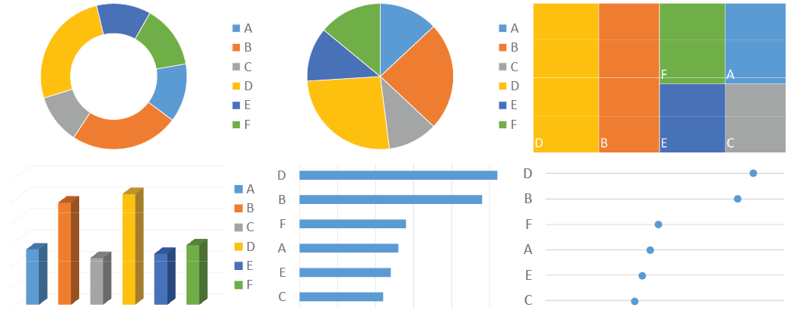

```{r setup, include=FALSE}
knitr::opts_chunk$set(echo = FALSE)
```

<iframe width="560" height="315" src="https://www.youtube.com/embed/pfxulpF9XOw" frameborder="0" allow="accelerometer; autoplay; encrypted-media; gyroscope; picture-in-picture" allowfullscreen></iframe>

The three laws of effective visual communication correspond to the three main ingredients of any quantitative work: purpose, data, and message. Getting these right leads to success; failing in any of them leads to overall failure. 

## Law 1: Have a clear purpose

Why? [@sinek2009start; @Bonate2014] What is the purpose of this display or that communication? Doumont [@Doumont2002] states this as the “zeroth law” of professional communication, “a principle so obvious that it had long been overlooked”. Be clear and explicit about what you want to achieve. Is it to explore some data, to convey an inferential analysis, to deliver a message, convince an audience, or support a decision? It may be a mixture of these – for example, even seemingly simple exploratory plots should serve some (perhaps implicit) decision (e.g. on how to explore further). Every graph, and more generally every communication, must be tailored to its specific purpose.

It helps to carve out the scientific question you are trying to address, ideally in discussion with partners, and to write it down explicitly. Try not to look at any data before. This is the concept of “question-based visualizations”[@Vandemeulebroecke2019]: let the scientific question determine what data to display and how. (For example, combine data from different domains if it helps address the question effectively. Do not only produce standard outputs by data domain – a display should be determined by the question it addresses, not by the way the data is organized.). As Diggle [@Diggle2018] put it, we “analyze problems, not data”. This does not mean that the question could not be refined after seeing the data. We may well iterate over the problem space and the solution space – as long as we do it consciously. Senn [@senn2008statistical] illustrates many examples of wrongly framed research questions. A common one is to focus on the wrong comparison, such as comparing a post-treatment value to the corresponding baseline value instead of to the value under a control treatment. Most quantitative graphs display comparisons [@Gelman2002], and it always helps to ask “compared to what?” [@Tufte1986]. If the comparison is not clear to the author, it will also not be clear to the reader.

Part of this first law (and of the third, see below) is also to be clear about your audience. Then, to adapt to your audience. Do not assume it will adapt to you. You cannot control your audience, but you can control what information and messages you deliver to it, and how. Is your audience just you (trying to see patterns in data), you in a few years (trying to remember what you did), quantitative experts such as your peers (interested in your methods), subject matter experts (eager for your main message), decision-makers (headlines only), or a mixture of these? Your visual communication will need to be different accordingly. Your communication (plot, presentation, report) is for the audience, not for you.

Clarity on the purpose and the scientific question of interest will help choose appropriate quantitative methods to address them. This, plus clarity on your audience, will help define the key messages and how to deliver them. (On the aspect of delivery see also Law 3 below.)

Of note, this first law is so important that it may occasionally defy other good principles. If your primary goal is to catch attention, then you may choose an iconic graphical representation that does this well, even if it violates some of the recommendations given further below [@Gelman2013]. However, you should never distort the data.

## Law 2: Show the data clearly

This is Tufte’s maxim [@Tufte1986]: “Above all else, show the data”. Show it accurately and clearly. This law has several faces:

* Simplify! “Simplify to clarify” [@Wong2010]. It is the prime task of quantitative scientists to make the complex simple: reveal structure in data through models, make inference through analyses, distill and convey conclusions through (visual) communication. Choose the simplest appropriate graph type; prefer familiar designs over fancy ones (see also the Cleveland-McGill effectiveness ranking in Law 3 below). Avoid fake dimensions. Make your plot “as simple as it can be, but not simpler” (attributed to Albert Einstein; also “Occam’s razor” or the law of parsimony). “Understand, edit and simplify the information and design with your readers in mind” [@wong2010wall]. Do not be confused: it is hard to make things simple. This is an iterative process: “edit and revise” [@Tufte1986], and repeat. 

* Maximize the data-to-ink ratio (also “data density index” [@Tufte1986]) within reason. Maximize the signal over the noise by removing the noise: remove anything that distracts from the purpose of the graph. Nothing is neutral: the choice of symbols or colors, background, fonts, line style, annotations. These elements are noise if they do not serve a clear purpose. Choose them wisely and parsimoniously; make the data stand out. Do not trust defaults in graphical software packages. Often, intelligent use of white space can structure a display better than a lot of ink. (The same holds for tables: these are often most effectively structured by reserving black lines for the horizontal direction and using simple alignment in the vertical direction.) Never clutter your graph with “chart junk” [@Tufte1997]. 

* Display the relevant data directly. In a quantitative workflow, this often means to look at the raw data and not just rely on summary statistics. Cabanski8 illustrates this with nine datasets that show completely different patterns despite identical marginal means, standard deviations and correlation coefficients (see also Anscombe [@Anscombe1973] and Matejka and Fitzmaurice [@Matejka2017]). Ask yourself what is the best way of summarizing the relevant features of the data; it may not be the mean +/- standard error. When fitting a (statistical, compartmental, mechanistic etc.) model to the data to draw inference or make predictions, model-derived quantities may be the relevant data to display. In this case a plot of the raw data may be misleading if it does not account for important covariates. In a final communication, display concisely what best supports your message (see also below, Law 3).

```{r, layout="l-body-outset", fig.cap="Law 2, show the data clearly. The pie and donut charts in panels A and B make it difficult to see the order of magnitude of some of the segments. The eye needs to compare areas, bent lengths (of the contour) or angles, graphical attributes that are not easily decoded. The donut chart even omits the angles. The mosaic plot in panel C only relies on areas; again it is hard to tell the order of magnitude. It is better to use lengths with a common baseline or positions on a common scale, such as in a barchart or dotplot (see Cleveland-McGill effectiveness ranking in Law 3). The barchart in panel D however introduces a fake dimension, which is unnecessary and makes it hard to decode the numerical values from the height of the bars. Panels E and F are appropriately simple and show the data clearly. They also order the data by magnitude to aid comparison even further. The dotplot in panel F uses minimal amount of ink and draws the eye to the position of the dots; it is the most effective way of displaying this data."}

```

Figure 1 illustrates some aspects of this second law. Wainer [@Wainer1984] has turned this law around, noting that “methods for displaying data badly have been developed for many years, and a wide variety of interesting and inventive schemes have emerged”. He provides 12 highly amusing rules for “how to display data badly”, with striking examples. He then concludes more seriously: “The rules for good display are quite simple. Examine the data carefully enough to know what they have to say, and then let them say it with a minimum of adornment. Do this while following reasonable regularity practices in the depiction of scale, and label clearly and fully.”

## Law 3: Make the message obvious

If the second law focused on the data (with a tendency to reduce noise), then the third is all about the message (and amplifying the signal). This assumes that you do have a message to tell, and that this message is clear at least to yourself. If there is any doubt on this, return to the first law.

The third law mandates to make your message as obvious as possible. Quoting Krzywinski and Cairo [@Krzywinski2013], “inviting readers to draw their own conclusions is risky”. Do not only make your message easy to get. Make it impossible to miss. This extends beyond graphical elements and involves all aspects of communication.

Clarity on your audience, mentioned already in the first law, is also a prerequisite for the third. It is needed for carving out the message to tell (Law 1) and for adapting its way of delivery (Law 3). 

Specific examples for the third law include the following:

*	Choose wisely how to encode the data you display. Color and area are good for drawing attention, but a viewer can decode positions on a common scale much more easily and accurately. Consider the effectiveness ranking of graphical attributes for encoding numerical values, as proposed by Cleveland and McGill [@Cleveland1985; @Cleveland1984; Cleveland.McGill1984; Cleveland1987; @Cleveland.McGill1985] (see also Cairo [@Cairo:2016], Munzner [@munzner2015visualization], and Heer and Bostock [@Heer:2010]). See [here](https://flowingdata.com/2010/03/20/graphical-perception-learn-the-fundamentals-first/) for an overview of this ranking. 

*	Exploit pre-attentive processing as much as possible [@Few:2012; @Ware:2004]. Some graphical features “jump to the eye” while others require careful inspection. Consider this in your choice of how to encode the data (Cleveland-McGill effectiveness ranking, see above) and in your choice of symbols, colors, line types etc. See [here](http://daydreamingnumbers.com/blog/preattentive-attributes-example/) for an illustration.

*	Avoid mental arithmetic. If differences or ratios are the main interest, show them directly. If both raw values and differences are of interest, consider showing both.

*	Exploit the principles of visual grouping [@Wong2010PointsOV]. Graphical entities are most effectively grouped by enclosure, connection, proximity and similarity (in this order). That is, similar objects are perceived as belonging together, as are objects close to each other, connected by lines, or enclosed in a common subspace. See Figure 3 for an illustration: these mechanisms can provide contextual information to a plot in a simple yet powerful way.

*	Minimize the viewer’s eye movement. Place elements that are to be compared close to each other. Prefer direct labelling over a legend. See also [here](https://www.storytellingwithdata.com/?offset=1531087200576).

*	Draw the reader’s attention to the main points. Use appropriate graphical features (e.g. bold or colored highlighting, reference lines, circling etc.). Follow up with explicit labelling (e.g. “treatment A outperforms treatment B by X%”).

*	Add meaningful information to a graph to tell the whole story. E.g., include reference lines, benchmark effects, inferences etc.

*	Use effective redundancy. Convey the same message through multiple channels, to amplify it and give the audience a second chance to get it. Use words and pictures in unison [@doumont2009trees]. E.g., in addition to showing the data, consider annotating the “good” or “bad” axis direction, and state what is seen in plain words. Do not confuse redundancy (pointlessly cluttering the graph) with effective redundancy (conveying a message through multiple complementary channels).

*	Let every plot stand on its own. Use informative labels and captions, and explain abbreviations. Do not require the reader to search through text in order to understand a figure.

* Always add a title to your plot. Phrase it as a conclusion, not a description (e.g. “plasma concentration depends on body weight” rather than “plot of plasma concentration vs. body weight”).  


