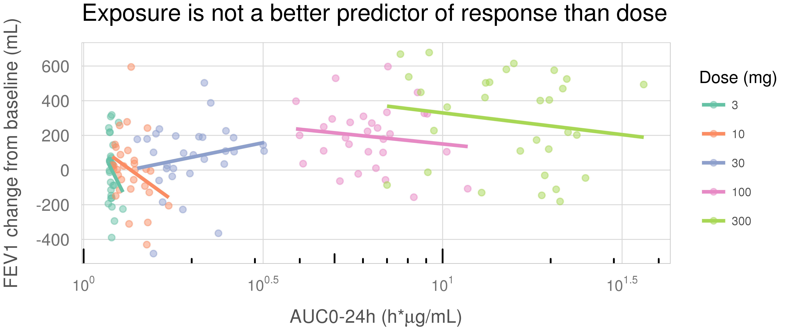

```{r setup, include=FALSE}
knitr::opts_chunk$set(echo = FALSE)
```

We have prepared a tutorial on "Effective visual communication for the quantitative scientist" which is in submission. A pre-print can be found at: [https://arxiv.org/abs/1903.09512](https://arxiv.org/abs/1903.09512) 

Example code from the tutorial is available [here](https://github.com/GraphicsPrinciples/tutorial-viz-com). 
These laws and recommendations are illustrated in a collection of [notebooks](https://graphicsprinciples.github.io/tutorial-case-studies).


```{r, fig.cap="Example plot from a notebook"}

```
